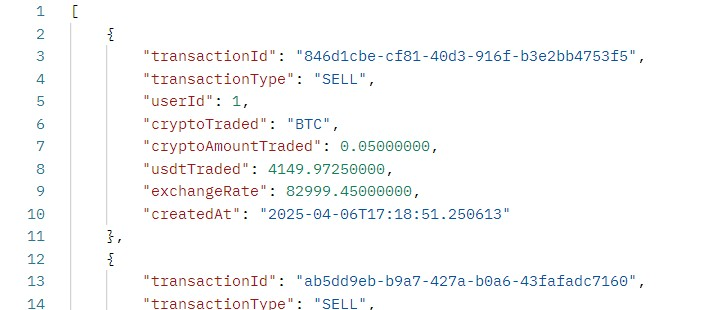

# crypto-test
A simple demo of a crypto trading system in Java

# Assumptions

- User has already authenticated and is authorised to access APIs
- User is only able to buy/sell ETHUSDT & BTCUSDT
- User's initial wallet balance is 50,000 USDT in database record
- System only supports a single user
- Wallet only holds 3 currencies: USDT, EHT and BTC
- Orders are executed at the latest ask/bid price
- No slippage and transaction fees

# API Endpoints
1 - `/prices` [GET]  
This is an automated endpoint that is triggered every 10 seconds after the previous one has finished.  
It is first triggered 10 seconds after application startup.  
Then triggered again 10 seconds after the first endpoint has finished its process.  
This endpoint retrieves prices of ETHUSDT and BTCUSDT from the Binance and Houbi APIs.  
It will save the lower ask price (and higher bid price) between the two sources into the `prices` database.  

2 - `/prices-manual` [GET]  
This endpoint retrieves the latest best aggregated price between the Binance and Houbi APIs on demand.  
No database calls.

3 - `/trade/buy"` [POST]  
This endpoint allows users to buy ETH or BTC with USDT.  
It requires 2 inputs in its request body:
- `crypto` - the symbol of the crypto to buy
- `amountInUsdt` - the amount of USDT used to buy crypto

4 - `/trade/sell"` [POST]  
This endpoint allows users to sell ETH or BTC and receive USDT.  
It requires 2 inputs in its request body:
- `crypto` - the symbol of the crypto to buy
- `amountToSell` - the amount of crypto to sell

5 - `/wallet` [GET]  
This endpoint retrieves the latest wallet balance of the user.  

6 - `/history` [GET]  
This endpoint retrieves the entire trading history of the user.  

# Demo
During the scheduled task, retrieved prices are logged (API #1).

Both Ask and Bid prices are been saved during the scheduled task (API #1). 
Do note that the prices are not saved every 10 seconds.  
This is because the price retrieval is only done 10 seconds after the previous job has finished. 

Initial wallet balance has an initial top up of 50,000 USDT.

Initial transaction audit table.

This the output for getting the best aggregated price (API #2).

This the output for getting the initial wallet balance (API #5).

This the output for getting the initial trading history (API #6).

Buy ETH with 5000 USDT (API #3)

Buy BTC with 5000 USDT (API #3)

Sell 2 ETH (API #4)

Sell 0.05 BTC (API #4)

Get wallet balance (API #5).

Get trading history (API #6).  
A total of 4 + 1 (initial topup) transactions.

Database for transactions audit table

Database for wallet balance

# Further Improvements
- Return a 400 error code for failed validation checks
- Add support for multiple users
- Add filter options for retrieving trading history